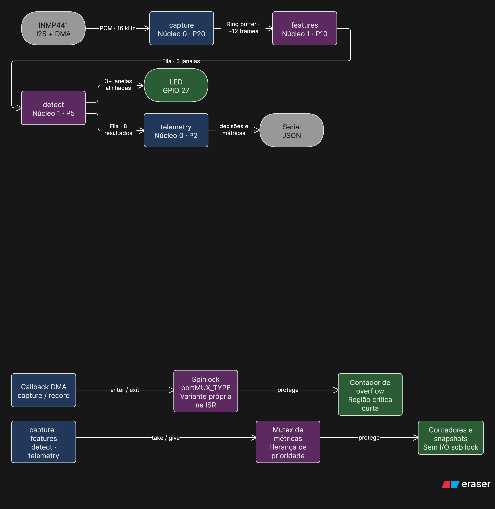
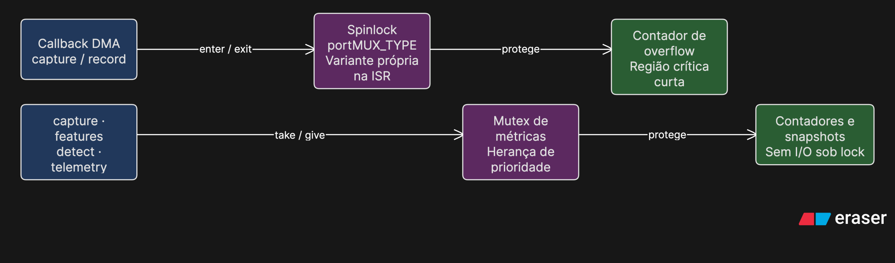

# Detector musical em ESP32

Detector de músicas com ESP32, INMP441 e FreeRTOS. O catálogo reúne 181 arquivos e 176 títulos da biblioteca fornecida de Pink Floyd. Versões com o mesmo título compartilham a classe. O reconhecimento roda na placa, sem internet, e o LED acende após acumular coincidências consistentes em pelo menos três janelas. Áudios sem correspondência suficiente são rejeitados.

O modelo FP32 alcançou 88,09% de acurácia no teste de reprodução simulada. Essa acurácia foi medida no computador; a avaliação acústica completa com o microfone ainda está pendente.

## Funcionamento

A captura lê blocos de 512 amostras a cada 32 ms, em mono a 16 kHz. O DMA tem reserva nominal de 128 ms; o ring buffer comporta aproximadamente 12 frames. Cada janela reúne 64 frames, ou 2,048 s de áudio. A tarefa de características calcula log10 RMS, centroide e 13 MFCCs com FFT de 512 pontos. Médias e desvios formam 30 valores.

Uma FFT de 4.096 pontos, com avanço de 512 amostras, extrai quatro picos espectrais. São 57 conjuntos de picos por janela. O mesmo DSP C é usado no treinamento e na placa.



| Tarefa | Prioridade | Núcleo | Função |
| --- | ---: | ---: | --- |
| capture | 20 | 0 | Ler I2S e publicar frames |
| features | 10 | 1 | Calcular MFCCs e picos |
| detect | 5 | 1 | Buscar no catálogo, classificar e controlar os LEDs |
| telemetry | 2 | 0 | Enviar resultados e estatísticas |

A captura, o DSP e a telemetria bloqueiam esperando dados. `detect` espera a fila por até 50 ms para também atualizar o aviso de falta de áudio; não usa espera ocupada. O consumidor devolve o item do ring buffer depois de processá-lo; as filas seguintes copiam as estruturas. O histórico da FFT pertence a `features`, a memória da busca pertence a `detect` e somente `detect` altera os dois LEDs. O índice é constante e fica na flash.



Um mutex com herança de prioridade protege os contadores das tarefas, sem I/O sob lock. O callback de overflow do DMA usa a variante de spinlock própria para ISR. Driver, ring buffer e filas já sinalizam a chegada de dados. Os diagramas foram feitos no [Eraser](https://app.eraser.io/workspace/xIBaK1rMj3eOerWGNEDG), com fontes editáveis em `docs/`.

Fila cheia causa descarte e incremento de contador. Uma perda de sequência ou mudança na época de overflow reinicia a janela e sua confirmação. Janelas com idade de software acima de 3,048 s são rejeitadas. O LED apaga ao rejeitar uma janela ou após 3,548 s sem receber outra. A confirmação exige pelo menos 6,144 s de áudio, além do processamento e do alinhamento com as janelas. Se faltar evidência, ele continua ouvindo.

## Reconhecimento

A referência inicial foi o [SeekTune](https://github.com/cgzirim/seek-tune). O reconhecimento usa coincidências espectrais que concordam no deslocamento temporal, seguindo o princípio de [Wang (2003)](https://swh.princeton.edu/~cuff/ele201/files/Wang03-shazam.pdf).

Para caber na placa, o índice guarda uma referência a cada quatro frames e remove assinaturas que aparecem mais de 64 vezes. A consulta tolera um bin de diferença. Uma busca inicial seleciona até 16 gravações; a comparação detalhada reutiliza o mesmo histograma para cada uma. Cada frame vota no máximo uma vez por alinhamento. Isso limita a memória, mas pode perder uma referência na seleção inicial.

Cada título recebe dois valores: proporção de frames alinhados e diferença para o segundo alinhamento distante mais de uma janela. As duas versões de um título contribuem para a mesma classe. Junto dos 30 descritores acústicos, são 382 entradas para uma regressão logística com 177 saídas, incluindo `ambiente`. O ONNX contém a padronização e o classificador; DSP e busca são etapas anteriores em C.

A validação comparou seis configurações de regularização e balanceamento, além dos limiares. Venceu C=3,0, sem pesos de classe, confiança mínima 0,90 e margem 0,30. A seleção maximiza macro-F1 menos duas vezes a taxa de falsos positivos. O piso de log10 RMS é −3,5. A busca completa está nos metadados do modelo.

A decisão guarda as últimas oito janelas, cerca de 16 s. Para acender o LED, pelo menos três precisam apontar para a mesma gravação e avançar no tempo com tolerância de dois frames. São exigidos 18 frames coincidentes no total, ao menos três por janela e vantagem de dois sobre outro alinhamento da mesma referência. Pelo menos uma dessas janelas precisa passar pelo limiar original do modelo. A janela atual deve contribuir; ambiguidade entre títulos mantém a saída como `desconhecida`. Isso permite reunir evidência entre janelas difíceis sem escolher um nome à força.

## Dados e avaliação

Foram usados todos os 181 arquivos fornecidos: 176 títulos em 16 pastas, cobrindo os 15 álbuns de estúdio, Relics e extras. Os cinco títulos repetidos mantêm suas duas referências. Existem tags de outros artistas em 52 arquivos. Isso não prova que estejam errados; os rótulos seguem os nomes e a identidade das gravações ainda precisa ser conferida. Veja a [conferência dos áudios](docs/conferencia-audios.md).

O manifesto negativo tem 111 entradas de Kevin MacLeod, correspondentes a 110 arquivos distintos. `No Frills Cumbia` foi registrada duas vezes com o mesmo arquivo, no treino e no teste: são 72 janelas em cada divisão. Os números abaixo preservam esse experimento; a avaliação de fundo não é totalmente independente e precisa ser refeita após corrigir a divisão e retreinar. Silêncio, tons e ruído sintético completam a classe `ambiente`. Ainda faltam vozes, mais artistas e ambientes reais.

As consultas-alvo usam trechos com início aleatório das gravações completas cadastradas, com ganho variável, ruído, ecos e filtro. São 21.222 janelas de treino, 7.266 de validação e 12.624 de teste. As sementes são distintas; trechos de um mesmo áudio podem se sobrepor entre divisões. O experimento mede novas consultas às gravações conhecidas, sem testar independência de sessão acústica ou reconhecimento de músicas nunca cadastradas. A configuração do classificador foi fixada antes dessa avaliação por janela. A confirmação temporal foi ajustada depois, com uma gravação física de diagnóstico, e reavaliada separadamente na reprodução contínua.

## Resultados

| Modelo | Acurácia | Macro-F1 | Acerto nos alvos | Falso positivo no fundo |
| --- | ---: | ---: | ---: | ---: |
| FP32 | 88,09% | 0,919 | 86,43% | 1,70% |
| FP16 | 88,09% | 0,919 | 86,43% | 1,70% |
| INT16 | 88,09% | 0,919 | 86,43% | 1,70% |
| INT8 | 87,31% | 0,913 | 85,47% | 1,36% |
| INT4 | 86,57% | 0,908 | 84,62% | 1,42% |

FP32 acertou 9.386 das 10.860 consultas-alvo. Houve 1.405 rejeições e 69 trocas entre títulos. No fundo, houve 30 aceitações indevidas em 1.764 janelas. A matriz completa está em [resultados-pink-floyd.json](docs/resultados-pink-floyd.json); o [resultado por faixa](docs/resultados-por-faixa.md) mostra os 176 títulos, inclusive os piores casos.

| Condição simulada | Acerto nos alvos, FP32 |
| --- | ---: |
| Sem ruído adicionado | 93,15% |
| Ruído a 20 dB | 92,76% |
| Ruído a 10 dB | 91,05% |
| Ecos | 81,99% |
| Filtro e ecos | 70,94% |
| Ganho baixo | 88,67% |

Só os 30 descritores acústicos, com o mesmo procedimento de seleção, alcançaram 20,92% de acurácia e 8,71% de acerto nos alvos. A [ablação](docs/ablacao.json) mostra o efeito de acrescentar o catálogo.

A [reprodução contínua](docs/reproducao-continua.json) percorreu os 181 arquivos em três condições, totalizando 4608 janelas e 9437,2 s virtuais. Incluiu 22 músicas negativas, das quais 21 não aparecem no treino, e separadores de silêncio, somando 2764,8 s de fundo: 450,6 s de músicas fora do catálogo e o restante de silêncio. As condições dos alvos foram sem ruído adicionado, ecos e filtro com ecos. Um evento é um trecho de até seis janelas; basta uma confirmação correta para contá-lo como reconhecido.

| Precisão | Trechos-alvo confirmados | Falsos eventos no fundo | Janelas com alerta de outro título |
| --- | ---: | ---: | ---: |
| FP32 | 515/543 | 0 | 2 |
| FP16 | 515/543 | 0 | 2 |
| INT16 | 515/543 | 0 | 2 |
| INT8 | 515/543 | 0 | 0 |
| INT4 | 516/543 | 0 | 0 |

FP32 confirmou 173 dos 176 títulos em pelo menos uma condição. `alan_s_psychedelic_breakfast`, `goodbye_cruel_world` e `one_of_the_few` não confirmaram nos trechos escolhidos. As duas janelas com nome errado confundiram as referências `in_the_flesh` e `in_the_flesh_1`. Zero alertas no fundo desse ensaio não garante erro zero em qualquer ambiente.

Em FP32, o tempo virtual até confirmar teve mediana de 6,144 s e p95 de 10,240 s. O relógio usa janelas alinhadas e atraso fixo de 100 µs; esses valores não são latência da placa. Injetando uma quebra de sequência em toda janela, houve zero confirmações nas cinco precisões, conforme o [ensaio com perdas](docs/reproducao-com-perdas.json). Esses testes executam o áudio e a decisão em C, sem simular I2S ou escalonamento FreeRTOS.

## Quantização e memória

As variantes usam os mesmos pesos e limiares. A calibração usa somente o treino. FP16 guarda pesos em meia precisão e acumula em FP32. INT16 quantiza pesos e ativações e acumula em INT64; INT8 usa INT32. INT4 guarda dois pesos por byte e usa ativações INT8. Escalas, bias, softmax e DSP continuam em ponto flutuante.

| Modelo | Parâmetros (bytes) | ONNX (bytes) | Flash ESP32 (bytes) | C médio no Mac (µs) | ONNX p95 no Mac (µs) |
| --- | ---: | ---: | ---: | ---: | ---: |
| FP32 | 274.220 | 278.426 | 3.200.114 | 41,75 | 4,88 |
| FP16 | 138.992 | 143.179 | 3.065.142 | 71,13 | 4,75 |
| INT16 | 139.704 | 144.586 | 3.066.070 | 12,72 | 38,42 |
| INT8 | 72.090 | 76.792 | 2.998.342 | 12,61 | 37,21 |
| INT4 | 38.283 | 42.895 | 2.964.626 | 23,16 | 57,75 |

O índice ocupa 2.704.024 bytes de flash e a busca usa 126.242 bytes de memória auxiliar. O firmware FP32 usa 144.992 bytes de RAM estática. Além disso, a FFT aloca 57.348 bytes de RAM interna uma única vez na inicialização; stacks, filas, DMA e ring buffer também consomem memória durante a execução. A stack de `detect` tem 12 KB. Compilar não comprova a folga de heap na placa.

INT8 reduziu os parâmetros do classificador em 73,71% e a flash total em 201.772 bytes. O custo do catálogo permanece igual. A tabela mostra que economizar memória e acelerar inferência são medidas distintas; FP32 continua como padrão para a primeira validação física.

O benchmark de inferência usa uma thread, 30 medições C após aquecimento e 1.000 chamadas ONNX individuais. O tamanho dos lotes é ajustado ao número de operações e está no [relatório de quantização](docs/quantizacao.json), junto do ambiente utilizado. Na reprodução contínua, o processamento de features e busca teve p95 de 4,94 ms no Mac, incluindo a ponte Python. Nenhum desses tempos representa o ESP32.

O maior erro absoluto entre probabilidades ONNX e C foi 7,4 × 10⁻⁶, arredondado para cima. Os tamanhos de flash incluem o painel; os benchmarks do classificador são do experimento original, sem retreino.

## Validação

Os 52 testes automatizados passaram. Eles verificam o DSP contra uma implementação independente em NumPy, a busca no catálogo, a equivalência entre ONNX e C nas cinco precisões, a confirmação após perdas, o aviso de falta de áudio, a leitura dos dados de teste e os avisos de sobreposição entre divisões. Os oito ambientes de firmware compilaram. Os [registros de verificação](docs/verificacao-bancada.json) guardam os tamanhos e hashes dos binários.

No ESP32 físico, os dois LEDs alternaram no teste de ligações. O INMP441 capturou 10,016 s sem perda de pacotes, com 0,06% de clipping; voz e palmas foram confirmadas na escuta. O Wokwi foi usado na versão anterior para verificar painel e boot; o microfone virtual não gera áudio.

No ESP32, o reconhecimento ainda foi intermitente. Dois ensaios com a regra temporal não confirmaram Money: 21 janelas em 45 s e 13 em 30 s. Mantendo a serial aberta, o trecho inicial de 50 s confirmou Money em 3 das 23 janelas, sem anunciar outro título. O primeiro alerta surgiu 32,32 s após abrir a porta; a música já estava tocando, então isso não é latência desde o início acústico. O celular estava a aproximadamente 5–10 cm da abertura do microfone.

Creep, do Radiohead, foi rejeitada nas 28 janelas coletadas em um minuto, sem alerta indevido. Esses ensaios tiveram zero perdas e heap livre mínimo de 56.444 bytes. São testes iniciais com duas músicas; não representam a acurácia física do catálogo. O WAV usado para ajustar a regra temporal fica separado das reproduções posteriores.

A telemetria registra tempos por etapa, perdas, heap e stack. O modo `stress` adiciona 80 ms por frame para provocar sobrecarga. Ainda faltam uma avaliação acústica ampla, estabilidade prolongada e comparação das precisões usando os mesmos trechos e condições. O [protocolo de avaliação](docs/protocolo.md) descreve esses ensaios e a separação das sessões de treino e teste.

## Demonstração

Vídeo do sistema funcionando: a adicionar.

## Como executar

Requisitos: ESP32 clássico de dois núcleos com 4 MB de flash, Python 3.11 a 3.13, [uv](https://docs.astral.sh/uv/getting-started/installation/) e compilador C. No macOS, use as ferramentas de linha de comando do Xcode. O catálogo e os modelos treinados já estão no repositório.

Na raiz do projeto:

```bash
export PATH="$HOME/.local/bin:$PATH"
uv sync --locked
uv tool install platformio
uv run pytest -q
pio run -e detector
```

Para gravar na placa e acompanhar a saída, substitua `PORTA` pela porta USB mostrada em `pio device list`:

```bash
pio device list
pio run -e detector -t upload --upload-port PORTA
pio device monitor -p PORTA -b 115200
```

`detector` usa FP32. Para as outras precisões, troque o ambiente por `detector_fp16`, `detector_int16`, `detector_int8` ou `detector_int4`. A serial mostra a música candidata, o alerta, a precisão e os tempos medidos. O detector começa ao ligar a placa. O LED verde indica reconhecimento; o vermelho pisca se faltarem janelas de áudio válidas.

O firmware fica em `src/`, os modelos ONNX em `model/` e os scripts de treino e avaliação em `tools/`. Diagramas e resultados detalhados ficam em `docs/`. Os comandos para [reproduzir o treino e os testes](docs/protocolo.md#reprodução-no-computador) usam os áudios locais, que ficam fora do Git.
